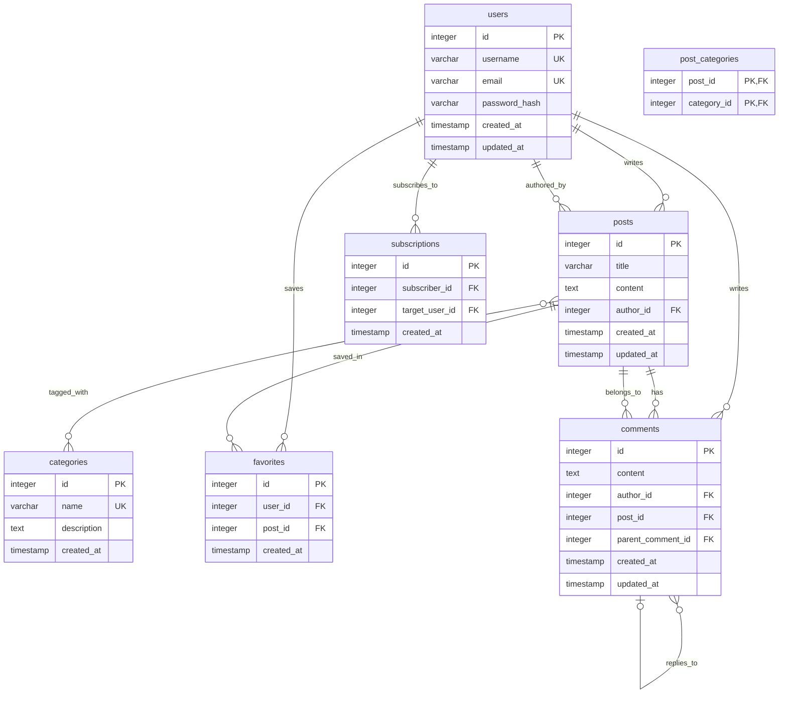

# ER Diagram for Blog System

```mermaid
erDiagram
    users {
        integer id PK
        varchar username UK
        varchar email UK
        varchar password_hash
        timestamp created_at
        timestamp updated_at
    }

    categories {
        integer id PK
        varchar name UK
        text description
        timestamp created_at
    }

    posts {
        integer id PK
        varchar title
        text content
        integer author_id FK
        timestamp created_at
        timestamp updated_at
    }

    post_categories {
        integer post_id PK,FK
        integer category_id PK,FK
    }

    favorites {
        integer id PK
        integer user_id FK
        integer post_id FK
        timestamp created_at
    }

    comments {
        integer id PK
        text content
        integer author_id FK
        integer post_id FK
        integer parent_comment_id FK
        timestamp created_at
        timestamp updated_at
    }

    subscriptions {
        integer id PK
        integer subscriber_id FK
        integer target_user_id FK
        timestamp created_at
    }

    users ||--o{ posts : writes
    users ||--o{ favorites : saves
    users ||--o{ comments : writes
    users ||--o{ subscriptions : subscribes_to
    posts }o--|| users : authored_by
    posts }o--o{ categories : tagged_with
    posts ||--o{ comments : has
    posts ||--o{ favorites : saved_in
    comments }o--|| posts : belongs_to
    comments }o--o| comments : replies_to
```
